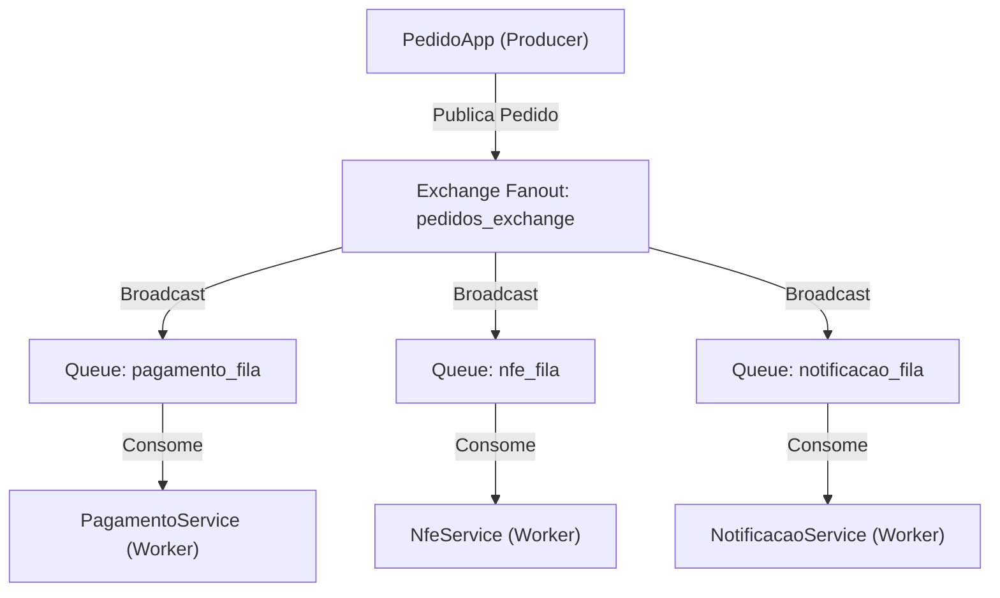

# Sistema de Pedidos com RabbitMQ



Este projeto simula um sistema de pedidos distribuído, utilizando RabbitMQ para comunicação entre serviços. Cada serviço é um microserviço .NET e a comunicação é feita via mensagens publicadas em uma exchange do tipo Fanout.

## Serviços
- **PedidoApp**: Simula a criação de pedidos (Producer)
- **PagamentoService**: Processa pagamentos (Consumer)
- **NfeService**: Gera nota fiscal (Consumer)
- **NotificacaoService**: Notifica o cliente (Consumer)

## Como rodar localmente com Docker

### Pré-requisitos
- Docker
- Docker Compose

### Passos
1. **Build e start dos containers**

```sh
docker-compose up --build
```

2. **Acessar o RabbitMQ Management**
- URL: [http://localhost:15672](http://localhost:15672)
- Usuário: `guest`  Senha: `guest`

3. **Usar o sistema**
- O serviço `pedidoapp` irá solicitar nomes de clientes no terminal. Para interagir, acesse o container:

```sh
docker-compose exec pedidoapp sh
# depois
dotnet PedidoApp.dll
```

- Os outros serviços processam automaticamente os pedidos recebidos.

### Parar os containers
```sh
docker-compose down
```

## Estrutura do Projeto
- Cada serviço tem seu próprio Dockerfile.
- O compose orquestra todos os serviços e o RabbitMQ.

## Observações
- O RabbitMQ precisa estar rodando para os serviços funcionarem.
- As filas são duráveis e o processamento usa confirmação manual.
- Para testes locais sem Docker, basta rodar `dotnet run --project <Servico>`.

---

Qualquer dúvida ou sugestão, fique à vontade para abrir uma issue ou contribuir! 